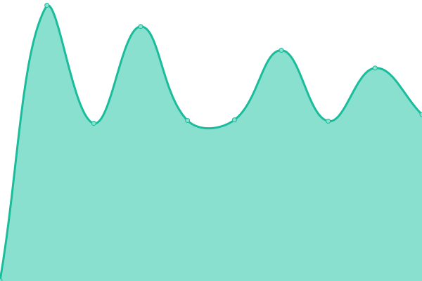
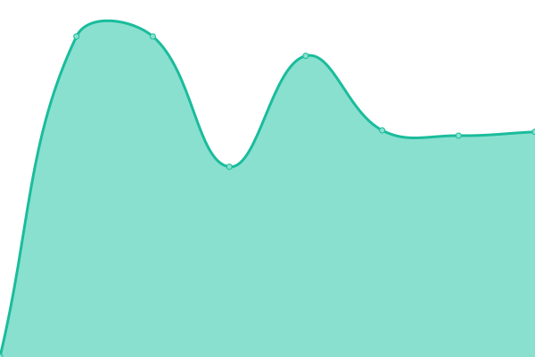

# [📈 Live Status](https://status-test.hyper-hub.nl): <!--live status--> **🟩 All systems operational**

This repository contains the open-source uptime monitor and status page for [Timor2011Pro](https://status-test.hyper-hub.nl), powered by [Upptime](https://github.com/upptime/upptime).

With [Upptime](https://upptime.js.org), you can get your own unlimited and free uptime monitor and status page, powered entirely by a GitHub repository. We use [Issues](https://github.com/Timor2011Pro/status-test/issues) as incident reports, [Actions](https://github.com/Timor2011Pro/status-test/actions) as uptime monitors, and [Pages](https://status-test.hyper-hub.nl) for the status page.

<!--start: status pages-->
<!-- This summary is generated by Upptime (https://github.com/upptime/upptime) -->
<!-- Do not edit this manually, your changes will be overwritten -->
<!-- prettier-ignore -->
| URL | Status | History | Response Time | Uptime |
| --- | ------ | ------- | ------------- | ------ |
|  [Main-Site](https://hyper-hub.nl) | 🟩 Up | [main-site.yml](https://github.com/Timor2011pro/status-test/commits/HEAD/history/main-site.yml) | 

 2200ms
     
 | 

<a href="https://status-test.hyper-hub.nl/history/main-site">100.00%</a>
    

|  [Game-Panel](https://panel.hyper-hub.nl) | 🟩 Up | [game-panel.yml](https://github.com/Timor2011pro/status-test/commits/HEAD/history/game-panel.yml) | 

 653ms
     
 | 

<a href="https://status-test.hyper-hub.nl/history/game-panel">100.00%</a>
    

|  [Mijn-HyperHub](https://my.hyper-hub.nl) | 🟩 Up | [mijn-hyper-hub.yml](https://github.com/Timor2011pro/status-test/commits/HEAD/history/mijn-hyper-hub.yml) | 

 660ms
     
 | 

<a href="https://status-test.hyper-hub.nl/history/mijn-hyper-hub">100.00%</a>
    

|  [Status Page](https://status.hyper-hub.nl) | 🟩 Up | [status-page.yml](https://github.com/Timor2011pro/status-test/commits/HEAD/history/status-page.yml) | 

 967ms
     
 | 

<a href="https://status-test.hyper-hub.nl/history/status-page">99.89%</a>
    

<!--end: status pages-->

[**Visit our status website →**](https://status-test.hyper-hub.nl)

## 📄 License

- Powered by: [Upptime](https://github.com/upptime/upptime)
- Code: [MIT](./LICENSE) © [Anand Chowdhary](https://anandchowdhary.com), supported by [Pabio](https://pabio.com)
- Data in the `./history` directory: [Open Database License](https://opendatacommons.org/licenses/odbl/1-0/)
